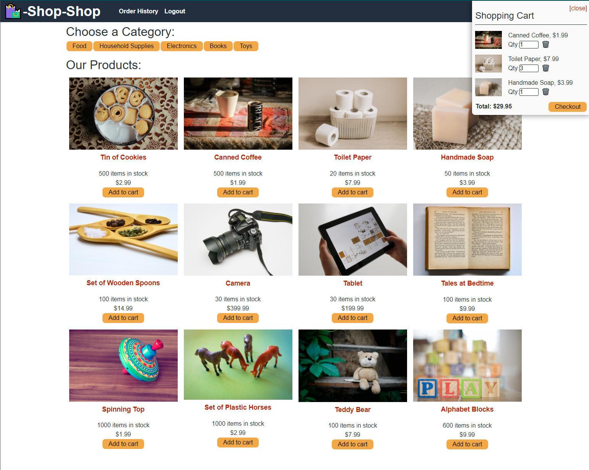

# Google-Books-Graphql-API

    

## Description

A react application that leverages the power of graphql to query data from a mongo database and uses redux to maintain global state

## Table of Contents

* [Technologies](#technologies)
* [Installation](#installation)
* [Usage](#usage)
* [License](#license)
* [Credits](#credits)
* [Contribution](#contribution)
* [Test](#test)
* [Questions](#questions)

## Technologies

* HTML, CSS, Javascript, React, graphql, Apollo server, Apollo client, Redux

## Installation

1. Fork this repository to a local repository
2. Open the application folder in VSCode.
3. Install node dependencies by running "npm install from the root folder and follow the prompts"(requires node already be installed on your machine. reference: nodejs.org)
4. In VSCode terminal, run "npm start" from the root folder to start the server and react application.

## Usage

This Application should only be used for personal projects. You may not sell or distribute this application

## License

## Credits

[Hameed1239](https://github.com/hameed1239)

## Contribution

You can contribute to this project by creating an issue on this repository

## Test

Link to app: [Google Books API](https://redux-react-shop-hameed1239.herokuapp.com/)

Screenshots:

## Questions

You can create issues on my git hub page

[hameed1239](https://github.com/hameed1239)

You can also contact me via email @ hameeddecoder@gmail.com
